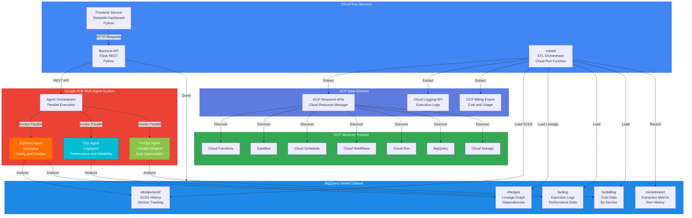
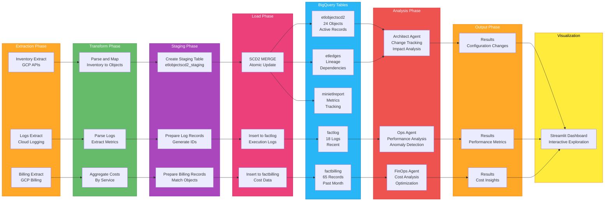

# SyncFlow GCP Intelligence

A multi-agent system for analyzing and optimizing GCP infrastructure with automated metadata collection, cost analysis, and performance insights.

## Overview

**SyncFlow GCP Intelligence** combines intelligent data extraction with parallel multi-agent analysis to deliver correlated insights about your GCP infrastructure:

- **Mini ETL**: Automated metadata collection and lineage tracking across GCP resources
- **Three Specialized Agents**: Architect (configuration), Ops (performance), FinOps (cost optimization)
- **REST API** (Flask): Programmatic access for automation and integration
- **Interactive Dashboard** (Streamlit): Visual exploration and multi-agent analysis
- **ADK Integration**: Google Agentic Development Kit support for extended capabilities

**Key Innovation**: Rather than one monolithic analysis system, three focused agents analyze the same infrastructure simultaneously from different perspectives (architecture, operations, costs), delivering correlated insights in parallel (5-15 seconds per analysis).

## System Architecture

### High-Level Overview



### Data Flow Pipeline



## Quick Start

### Prerequisites

- Python 3.10+
- GCP Project with BigQuery enabled
- Service account with appropriate permissions
- Bash or PowerShell terminal

### Installation

```bash
# 1. Clone and navigate to repository
cd SyncFlow_GCP_Intelligence

# 2. Create virtual environment
python -m venv .venv

# On Linux/macOS
source .venv/bin/activate

# On Windows
.venv\Scripts\activate

# 3. Install dependencies
pip install -r backend/requirements.txt
pip install -r minietl/requirements.txt
pip install -r frontend/requirements.txt

# 4. Configure environment
cp .env.example .env
# Edit .env with your GCP project and service account path
export GOOGLE_APPLICATION_CREDENTIALS=/path/to/service-account.json
export GCP_PROJECT=your-project-id
export BQ_DATASET=minietl
```

### Running the System

**Terminal 1 - Backend API**:
```bash
export GCP_PROJECT=prismatic-smoke-463810-c1
export BQ_DATASET=minietl
export GOOGLE_APPLICATION_CREDENTIALS=/path/to/service-account.json
python -m backend.syncflow_server --port 5000
```

**Terminal 2 - Frontend Dashboard**:
```bash
streamlit run frontend/dashboard.py --server.port 8501
```

Access the dashboard at: **http://localhost:8501**

## Development

### Project Structure

```
SyncFlow_GCP_Intelligence/
├── backend/                      # Flask REST API
│   ├── app/
│   │   ├── api/                 # REST endpoints
│   │   ├── core/                # Configuration
│   │   ├── orchestration/       # Agent coordination
│   │   └── storage/             # BigQuery client
│   ├── agents/                  # ADK agents
│   │   ├── architect_agent_adk.py
│   │   ├── models_adk.py
│   │   └── tools/
│   ├── tests/
│   ├── syncflow_server.py       # Flask entry point
│   └── requirements.txt
├── frontend/                     # Streamlit Dashboard
│   ├── dashboard.py
│   └── requirements.txt
├── minietl/                      # ETL orchestrator
│   ├── main.py
│   ├── cloud_scheduler_trigger.sh
│   └── requirements.txt
└── README.md
```

### Development Commands

#### Backend Development

```bash
# Start Flask server
python -m backend.syncflow_server \
  --sa /path/to/service-account.json \
  --project prismatic-smoke-463810-c1 \
  --port 5000

# Or use environment variables
export GCP_PROJECT=prismatic-smoke-463810-c1
export BQ_DATASET=minietl
export GOOGLE_APPLICATION_CREDENTIALS=/path/to/service-account.json
python -m backend.syncflow_server
```

#### Frontend Development

```bash
# Start Streamlit dashboard
streamlit run frontend/dashboard.py --server.port 8501

# Access at http://localhost:8501
```

#### Testing

```bash
# All backend tests
pytest backend/tests

# With coverage
pytest backend/tests --cov=backend

# Specific test module
pytest backend/tests/api/test_architect_adk_api.py

# ADK agent tests only
pytest backend/agents/test_architect_workflow.py

# Verbose output
pytest backend/tests -v
```

#### Code Quality

```bash
# Format code
black backend frontend minietl --line-length 88

# Lint
flake8 backend frontend minietl

# Type check
mypy backend
```

#### miniETL Operations

```bash
# Deploy Cloud Function and scheduler
cd minietl
chmod +x cloud_scheduler_trigger.sh
./cloud_scheduler_trigger.sh

# Trigger extraction on demand
gcloud functions call minietl-extraction-function \
  --region=australia-southeast1 \
  --project=prismatic-smoke-463810-c1 \
  --data='{"extraction_type": "all"}'

# View logs
gcloud functions logs read minietl-extraction-function \
  --region=australia-southeast1 \
  --project=prismatic-smoke-463810-c1
```

## API Endpoints

### Object Management
- `GET /api/objects` - List all ETL objects
- `GET /api/objects/<id>` - Get object details
- `GET /api/objects/<id>/history` - Version history
- `GET /api/objects/by-type/<type>` - Filter by type
- `GET /api/objects/search?q=<query>` - Full-text search

### Lineage
- `GET /api/lineage/<id>/upstream` - Upstream dependencies
- `GET /api/lineage/<id>/downstream` - Downstream dependencies
- `GET /api/lineage/<id>/full` - Complete lineage graph

### Multi-Agent Analysis
- `GET /api/agents/analyze/<id>` - Run all three agents in parallel
- `GET /api/agents/doc/<id>` - Architect Agent only (config & lineage)
- `GET /api/agents/log/<id>` - Ops Agent only (performance & reliability)
- `GET /api/agents/cost/<id>` - FinOps Agent only (cost optimization)

### Metrics
- `GET /api/metrics/<id>/executions` - Execution logs (with optional `?days=7&limit=100`)
- `GET /api/metrics/<id>/costs` - Cost data (with optional `?days=30`)

### System
- `GET /api/health` - Backend health check
- `GET /api/stats` - System statistics

## Architecture Details

### Layered Backend Architecture

The backend (`backend/`) is organized into distinct layers:

**1. API Layer** (`backend/app/api/`)
- `health.py` - Health check endpoint
- `objects.py` - CRUD operations for ETL objects and lineage
- Routes: `/api/objects/*`, `/api/lineage/*`, `/api/metrics/*`, `/api/health`

**2. Core/Config Layer** (`backend/app/core/`)
- `config.py` - Environment-based AppSettings configuration
- Reads from: `GCP_PROJECT`, `BQ_DATASET`, `GOOGLE_APPLICATION_CREDENTIALS`, etc.

**3. Orchestration Layer** (`backend/app/orchestration/`)
- `orchestrator.py` - Coordinates multi-agent analysis workflows
- Calls three agents (Architect/Ops/FinOps) and aggregates results

**4. Storage Layer** (`backend/app/storage/`)
- `bigquery.py` - BigQueryStorage class with table schema caching
- Handles exceptions: StorageError, NotFoundError

**5. ADK Agents** (`backend/agents/`)
- `architect_agent_adk.py` - Google ADK-based Architect Agent (dual-agent pattern)
- `models_adk.py` - Pydantic models for ADK agents
- `tools/` - Composable agent tools
  - `inventory_tools.py` - 6 inventory analysis functions
  - `lineage_tools_adk.py` - 4 recursive lineage analysis functions
  - `proposal_tools.py` - 5 proposal generation functions
  - `update_tools.py` - 3 update/implementation functions

### BigQuery Schema

**Core Tables**:
- `etlobjectscd2` - SCD Type 2 object registry with version history
- `etledges` - Dependency relationships (parent_id → child_id)
- `factlog` - Execution logs (duration, status, records_processed)
- `factbilling` - Cost data (service, cost_usd, compute_units)

**ADK Tables**:
- `architect_proposals` - Proposal history
- `architect_audit_log` - Decision audit trail
- `architect_diagrams` - Stored Mermaid diagrams

### Multi-Agent Orchestration Pattern

Three agents run in parallel via `MultiAgentAnalyzer`:
- **Architect Agent**: Tracks configuration changes and lineage (SCD Type 2 history)
- **Ops Agent**: Analyzes performance metrics and anomalies (execution logs)
- **FinOps Agent**: Identifies cost optimization opportunities (billing data)

Each agent is independent and returns structured results that can be correlated.

## Code Style & Standards

- **Python**: 3.10+ with 4-space indentation
- **Functions**: `snake_case`
- **Classes**: `UpperCamelCase` (Pydantic models included)
- **Models**: Use Pydantic v2 with `field_validator` and explicit `ConfigDict`
- **Imports**: Group by standard library, third-party, local; use `from __future__ import annotations`
- **Type hints**: Always include return types; use `Optional[T]` for nullable values
- **BigQuery**: Use parameterized queries; avoid SQL injection via string formatting

### Commit Messages

Follow Conventional Commits:
- `feat:` - New feature
- `fix:` - Bug fix
- `refactor:` - Code reorganization (no behavioral change)
- `test:` - Test additions or updates
- `docs:` - Documentation changes
- `perf:` - Performance improvements

Example: `feat: add architect proposal generation with ROI ranking`

## Environment Configuration

### Required Environment Variables

```bash
# GCP Configuration
export GCP_PROJECT=prismatic-smoke-463810-c1
export BQ_DATASET=minietl
export BQ_LOCATION=us-central1

# Authentication
export GOOGLE_APPLICATION_CREDENTIALS=/path/to/service-account.json

# Backend Server
export FLASK_ENV=development
export HOST=127.0.0.1
export PORT=5000
export DEBUG=True

# Frontend (Streamlit)
export STREAMLIT_SERVER_PORT=8501
export STREAMLIT_SERVER_ADDRESS=0.0.0.0
```

### Configuration Loading Priority

1. Command-line arguments (e.g., `--port 5000`)
2. Environment variables
3. `.env` file (copy from `.env.example`)
4. Hardcoded defaults in `backend/app/core/config.py`

Configuration is loaded via `AppSettings.from_env()` and converted to Flask config with `.to_flask_config()`.

## Performance Characteristics

| Operation | Time | Notes |
|-----------|------|-------|
| List objects | <1s | BigQuery scan (cached) |
| Object details | 1-2s | Single row + metadata |
| Lineage resolution | 1-3s | Recursive CTE queries |
| Multi-agent analysis | 5-15s | All three agents in parallel |
| Query logs (7 days) | 1-3s | BigQuery filtering |
| Cost analysis (30 days) | 2-5s | Aggregation + calculations |

## Key Dependencies

### Core Libraries
- **google-cloud-bigquery**: BigQuery client and data models
- **flask**: REST API framework
- **pydantic**: Data validation and serialization
- **streamlit**: Interactive dashboard

### Supporting
- **pandas**: Data manipulation
- **requests**: HTTP client for inter-service communication
- **click**: CLI argument parsing
- **python-dateutil**: Date/time utilities
- **pytz**: Timezone handling

See `backend/requirements.txt` for complete dependency list with versions.

## Known Issues & Limitations

### Pre-Production Gaps

1. **Authentication**: No OAuth2/OIDC implemented (service account only)
2. **Authorization**: No role-based access control (RBAC)
3. **Test Isolation**: Tests mutate production BigQuery data
4. **Monolithic Backend**: `syncflow_server.py` is ~1800 lines (being refactored into layers)
5. **Error Handling**: Some code paths lack comprehensive error recovery

See `dev/REVIEW_SUMMARY.md`, `dev/TASKS_SECURITY.md`, and `dev/TASKS_TESTING.md` for detailed roadmap.

## Troubleshooting

### Backend fails to start: "Module not found"
```bash
# Ensure virtual environment is active
source .venv/bin/activate

# Install/reinstall dependencies
pip install -r backend/requirements.txt
```

### BigQuery authentication fails
```bash
# Verify service account path
echo $GOOGLE_APPLICATION_CREDENTIALS

# Test authentication
gcloud auth list
gcloud config list  # Check project

# Reactivate if needed
gcloud auth activate-service-account \
  --key-file=/path/to/service-account.json
```

### Port already in use
```bash
# Find process on port 5000
lsof -i :5000

# Kill if needed
kill -9 <PID>

# Or use different port
python -m backend.syncflow_server --port 5001
```

### Dashboard won't load
- Check backend is running: `curl http://127.0.0.1:5000/health`
- Check frontend logs: Check Streamlit terminal output
- Verify backend URL in `frontend/dashboard.py` (should be `http://127.0.0.1:5000`)

### Tests fail
- Use fakes (not live services): `backend/tests/fakes.py`
- Check fixtures in `backend/tests/conftest.py`
- Run with verbose output: `pytest backend/tests -v`
- Check `backend/agents/test_architect_workflow.py` for ADK agent examples

## Status & Next Steps

**Current Status** (as of Nov 8, 2025):
- ✅ Core backend working (Mini ETL + API)
- ✅ Frontend dashboard functional
- ✅ ADK Architect Agent Phase 1 complete (18 tools, 16 tests passing)
- ⚠️ Pre-production (lacking security, test isolation, comprehensive error handling)

**Immediate Priorities** (if contributing):
1. Review code in `backend/agents/` to understand ADK patterns
2. Add API integration tests in `backend/tests/api/test_architect_adk_api.py`
3. Implement Streamlit dashboard integration for Architect workflows
4. Deploy to Cloud Run (see `.cloudfunctions.net` URLs in minietl/)

**Long-Term** (see `dev/INDEX.md`):
- 65 tasks across 5 streams (Security, Architecture, Operations, Documentation, Testing)
- 8-week production readiness roadmap

## Contributing

Follow the development commands above and use Conventional Commits for messages. See CLAUDE.md for detailed development guidelines and architecture patterns.

## Documentation

For more detailed information, see:
- **CLAUDE.md** - Architecture patterns and development guidelines
- **shared/ARCHITECTURE_DIAGRAMS.md** - Complete system diagrams
- **backend/agents/README.md** - ADK Architect Agent deep dive
- **backend/agents/DESIGN_COMPARISON.md** - ADK vs. legacy Architect comparison
- **dev/INDEX.md** - Task tracking and roadmap

## License

[Add your license information here]

## Support

For help and feedback:
- Check the Troubleshooting section above
- Review the documentation files listed above
- Report issues on GitHub: [Add GitHub issues link]

---

**Last Updated**: November 8, 2025
