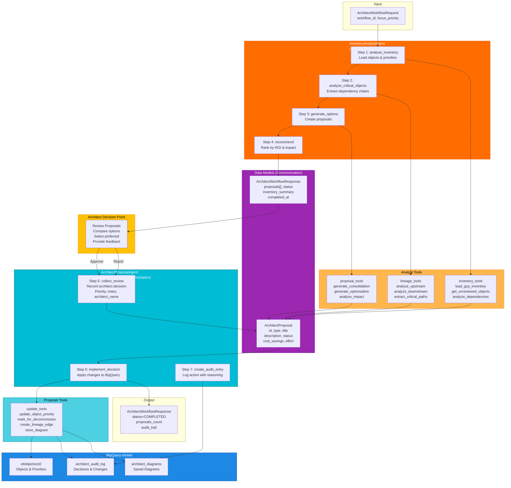
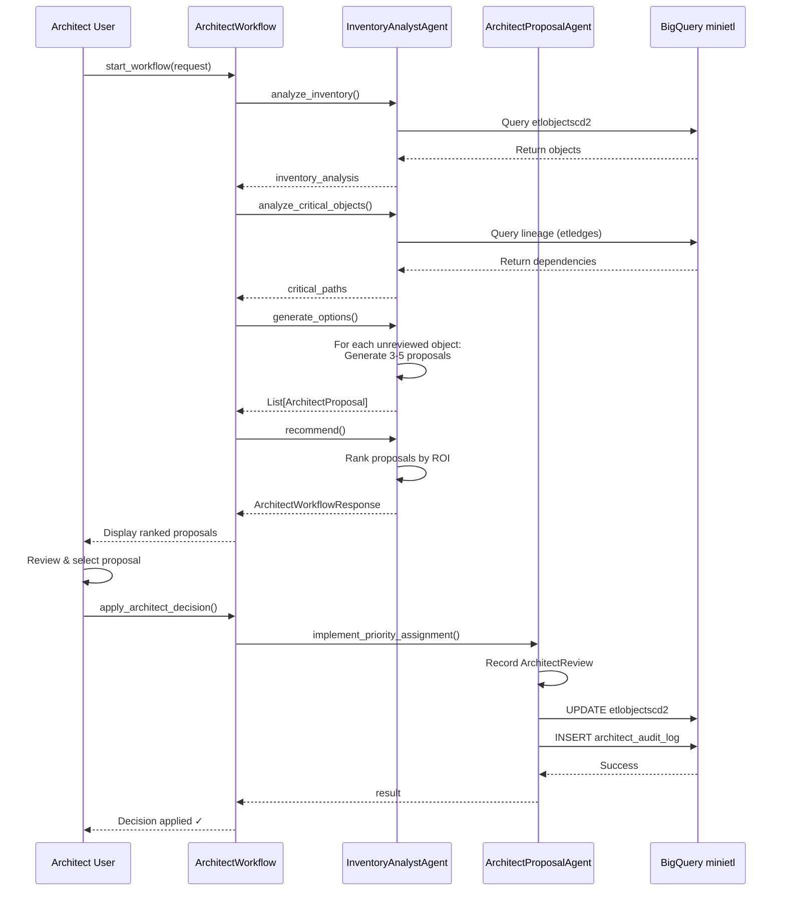
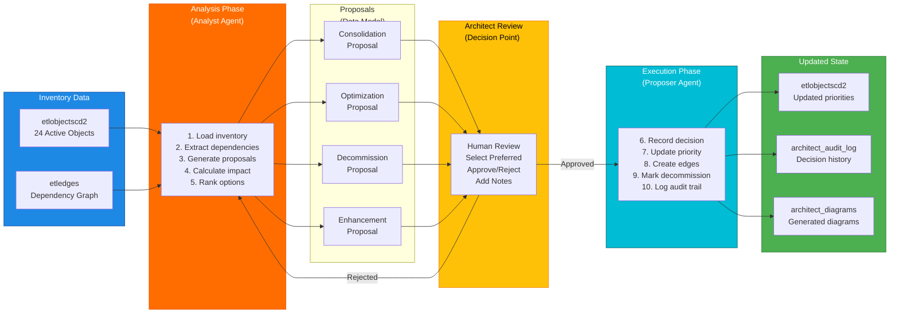
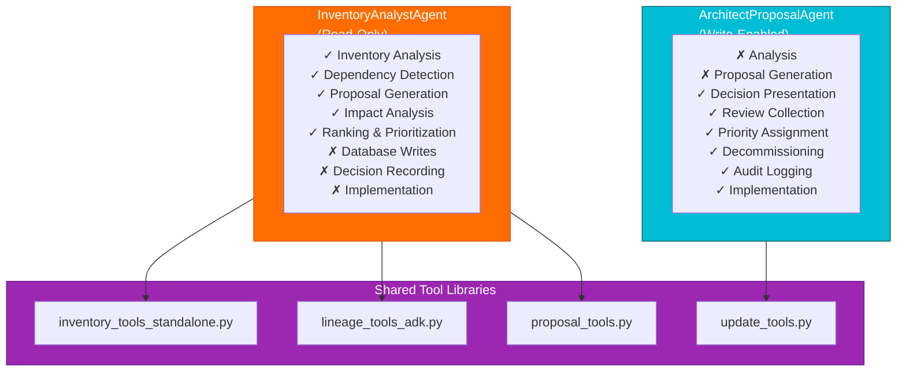
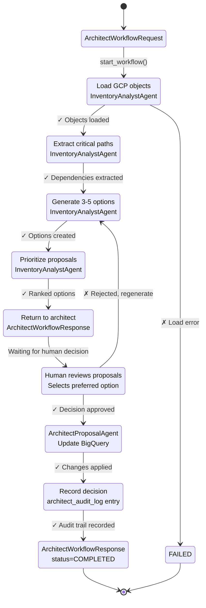
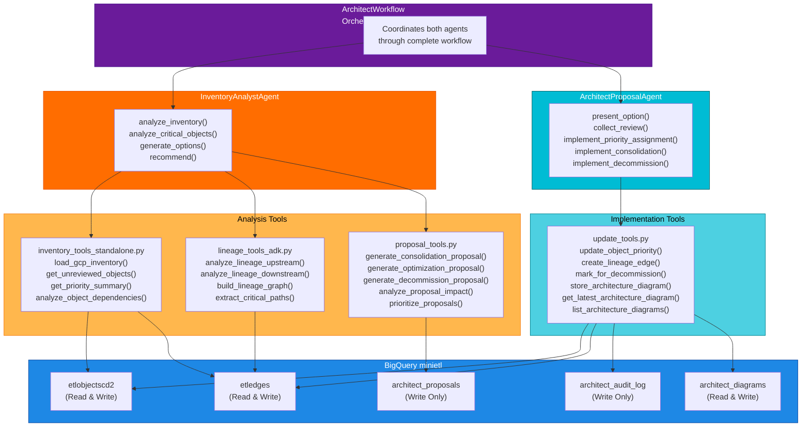

# ADK Architect Agent: Dual-Agent Communication Pattern

## Complete Workflow Diagram

## Agent Interaction Sequence Diagram

## Data Flow Diagram

## Agent Responsibility Matrix

## State Transition Diagram

## Complete Tool Interaction Map

