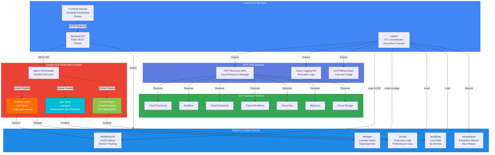
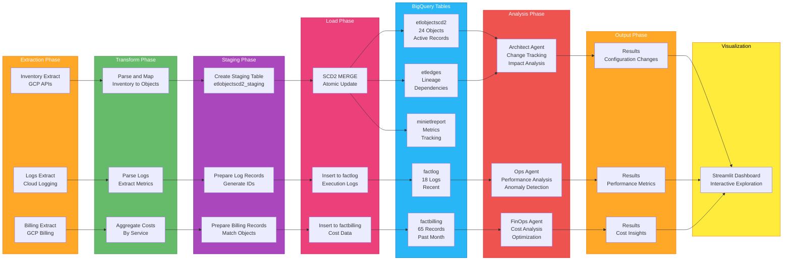
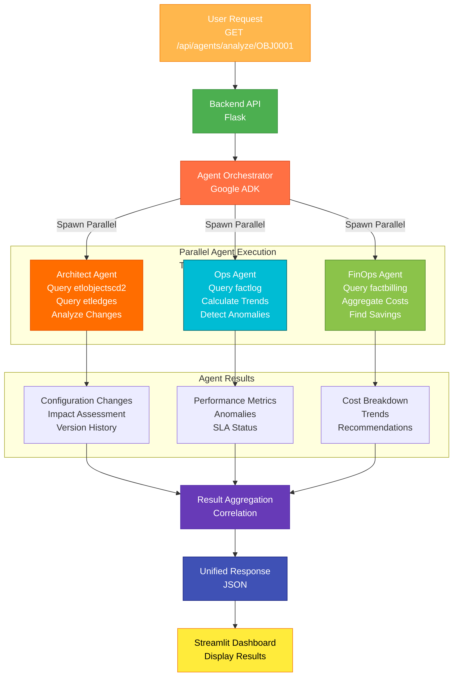
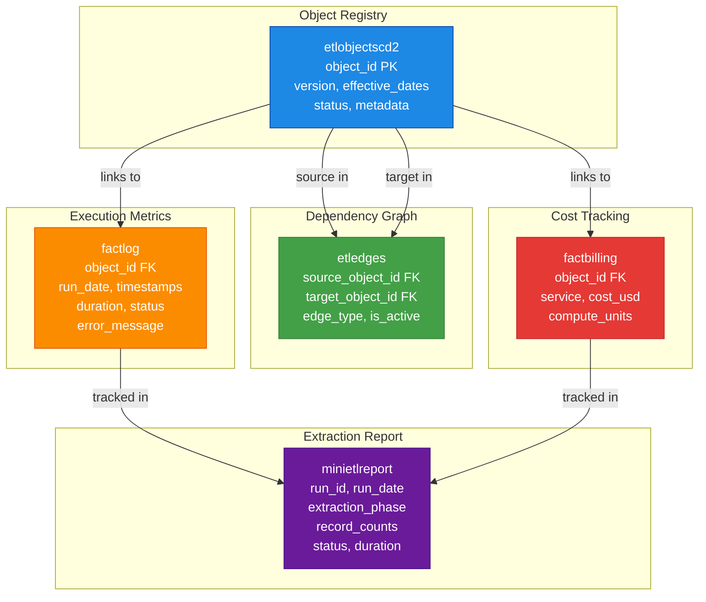
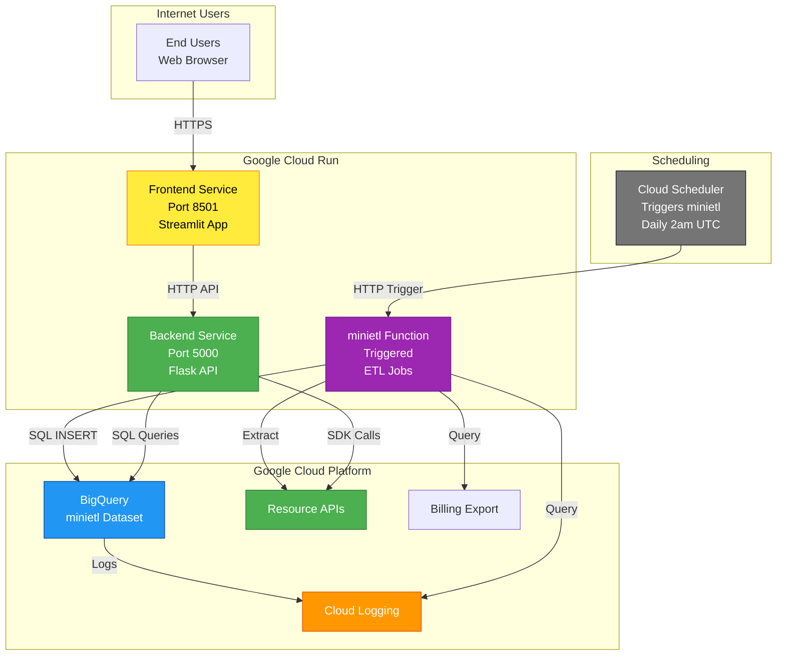
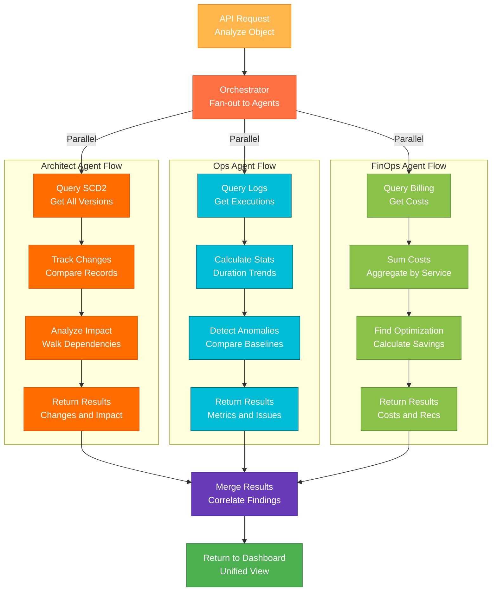

# SyncFlow Architecture Diagrams

## Diagram 1: Overall System Architecture

---

## Diagram 2: Data Flow Pipeline

---

## Diagram 3: Agent Orchestration Flow

---

## Diagram 4: Data Schema Relationships

---

## Diagram 5: Extraction Timeline

```mermaid
graph LR
    T0["0s<br/>Start"]
    T1["2s<br/>Init<br/>BigQuery"]
    T2["5s<br/>Discover<br/>24 Objects"]
    T3["8s<br/>Load<br/>Staging"]
    T4["15s<br/>MERGE<br/>Complete"]
    T5["20s<br/>Logs<br/>Extract"]
    T6["35s<br/>Logs<br/>Insert"]
    T7["40s<br/>Billing<br/>Extract"]
    T8["50s<br/>Billing<br/>Insert"]
    T9["55s<br/>Record<br/>Metrics"]
    T10["60s<br/>Done"]

    T0 -->|Inventory| T1
    T1 --> T2
    T2 --> T3
    T3 --> T4
    T4 -->|Logs| T5
    T5 --> T6
    T6 -->|Billing| T7
    T7 --> T8
    T8 --> T9
    T9 --> T10

    style T0 fill:#90CAF9,stroke:#1976D2,color:#fff
    style T1 fill:#90CAF9,stroke:#1976D2,color:#fff
    style T2 fill:#90CAF9,stroke:#1976D2,color:#fff
    style T3 fill:#90CAF9,stroke:#1976D2,color:#fff
    style T4 fill:#4CAF50,stroke:#2E7D32,color:#fff
    style T5 fill:#FFA726,stroke:#F57C00,color:#fff
    style T6 fill:#FFA726,stroke:#F57C00,color:#fff
    style T7 fill:#EF5350,stroke:#C62828,color:#fff
    style T8 fill:#EF5350,stroke:#C62828,color:#fff
    style T9 fill:#AB47BC,stroke:#6A1B9A,color:#fff
    style T10 fill:#4CAF50,stroke:#2E7D32,color:#fff
```

---

## Diagram 6: Cloud Run Service Interactions

---

## Diagram 7: Agent Decision Tree

---

## Diagram Legend

### Colors Used

| Color | Meaning |
|-------|---------|
| 🔵 Blue | Data Layer - BigQuery |
| 🟢 Green | Processing - Transform, Load, Complete |
| 🟠 Orange | Extraction - Input Data |
| 🔴 Red | Analysis - FinOps Agent |
| 🟦 Cyan | Analysis - Ops Agent |
| 🟨 Yellow | UI - Display, User Interaction |
| 🟣 Purple | Orchestration, Staging |
| 🟧 Orange-Red | Architect Agent |

### Diagram Overview

1. **Overall System Architecture** - Complete system with all components
2. **Data Flow Pipeline** - Extract → Transform → Load → Analyze → Display
3. **Agent Orchestration** - Parallel agent execution and result aggregation
4. **Data Schema Relationships** - How tables relate to each other
5. **Extraction Timeline** - Timing for each phase
6. **Cloud Run Service Interactions** - How services communicate
7. **Agent Decision Tree** - How each agent analyzes data independently
